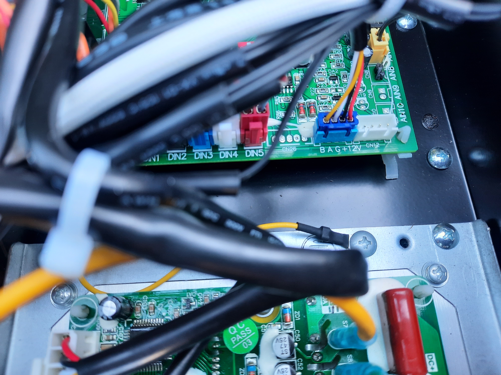

# Control Fairland (IPHCR45) heatpump through modbus and Home Assistant

In this project I modified my Fiarland pool heatpump to be controlled locally. No cloud service (Tuya) or internet connection is required. It is a fairly simple modification that doesn't require hardware changes or permanent damage to the device.

The main reason for this project is to unlock the super silence mode. This will limit the power to 24%, making the device quieter and more efficient.


The final result is a dashboard in home assistant with the following features.
| Feature | Description 
|---------|------------
| Error code | For example the no-flow (E3) warning
| Power on/off | Turn device on/off
| Desired temp | Use thermostat control to control temperature
| Current temp | Current inlet temperature
| Outlet temp | Current outlet temperature
| Ambient temp | Current ambient temperature
| Mode | Auto/Heat/Cool
| Working mode | Smart (100%)/Super Silence (24%)/Silence (85%)
| Compressor % | Current compressor percentage
| Power usage | Current amperate and voltage


Each sensor/switch will be visible as an entity in home assistant.

# Step 1 - Locate the rs485 connector
We will use modbus to communicate with the device. There is a connector on the main control board used for an optional WIFI module. The model I have already has this built-in in the display, so I will never use this. To access this port, open the top cover. This is done by removing 7 screws:
- 2 on the bottom, under the display. This removes the panel under the display.
- 2 under the display. This removes the display.
- 2 will appear on the bottom of the cover
- 1 screw is located at the back, under the cover
- The cover will now slide off, to the direction of the just removed screws

It could differ on your model.


I also removed the panels hiding the control board. It turned out that this is not nescessary, but it at least ensures you have the right cable.


The connector we will be using is marked on the image below.




# Step 2 - Connect the rs485 gateway

The connection is a modbus/rs485 connection. This is a serial bus. Luckally there are standard components that can convert this to ethernet. By doing this, you can control it over tcp/ip. This is the rs485 to eth gateway I use.


For testing purposes, I directly connected the modbus gateway. I followed the instructions from waveshark to do this. In my case, power over ethernet did not work. Instead I ended up using the 12v connection on the Fairland board. These are clearly marked (from left to right: B, A, 12v-, 12v+).


As stated before, it is not required to open up the device. This unused port connects to the outside of the unit. I ended up using this cable.


I couldn't find the correct connector, so I connected the wires with a crown stone. I used UTP cable, since I have plenty of it. Two for the serial communication and 2 for the 12v power. The cord is roughly 20 meters long and runs from the pool to indoor.


# Step 3 - Configure the rs485 to eth module
Once connected to the network, the rs485 gateway can be accessed through the browser. There is also a tool that can be downloaded from the website, but I didn't need it. Good news, since I am on Linux. The default addess is: http://192.168.1.200/
The default password is empty, just press login. I changes the device IP and subnet to match my internal network. The other settings are in the screenshot below. Please refer to the manufacturer website for more details (https://www.waveshare.com/wiki/RS485_TO_ETH_(B)).


# Step 4 - Configure Home Assistant
I am using the docker version of Home Assistant, but that shouldn't matter. First we need to enable modbus. This is done by first adding this line to the bottom of (the config can also be done inline, but I like to separate it) `configuration.yaml`:
```
modbus: !include modbus.yaml
```

Then create a file named `modbus.yaml` and add the required configuration. The full config can be found [here](scripts/modbus.yml), but I will explain the important bits.

We  need to add the config for the modbus device, in this case the ip and port. The most basic setup is the sensor for the on/off state. This is a binary sensor. 
```
- name: waveshare1
  type: tcp
  host: 192.168.178.200
  port: 4196
  delay: 2
  timeout: 5
  binary_sensors:
    - name: "Fairland Pool WPU Status"
      unique_id: "fairland_wpu_status"
      address: 0
      scan_interval: 10
      slave: 1
```

A sensor can only read state. To turn the pump on/off we need a switch. Notice the write type and input types. The switch is a coil.
```
  switches:
    - name: Fairland Pool WPU On/Off Switch
      unique_id: "switch.fairland_pool_wpu_on_off_switch"
      slave: 1
      address: 0
      command_on: 1
      command_off: 0
      write_type: coil
      verify:
          input_type: coil
          address: 0
          delay: 1
          state_on: 1
          state_off: 0
```

There are multinple entities to be configured:
- binary_sensors -> contains 0/1 to tell state
- switches -> it allows writing 0/1
- sensors -> reading values (like current temperature)
- climates -> Not required, but uses multiple registers to create a climate control device (like airco) in home assistant, for easier control.

To completely configure the device, we need to map the correct addresses from the device in the config file. The images below will give a complete overview. It is a bit hard to read though.

A good source to setup your configuration is the Home Assistant modbus documentation, combined with the info below: https://www.home-assistant.io/integrations/modbus/

The first image shows the register types. Each register type maps to an input_type in home assistant.
| Type | Home Assistant input_type
|------|---------------
| 0x - Read & Write | input_type: coil
| 1x - Read-only | input_type: discrete_input 
| 3x - Read-only| input_type: input
| 4x - Read & Write | input_type: holding


The addresses list below can be combined with the register type table above. 


Note that the temperatures require a conversion. It is described in the image above, but the implementation can be found in the complete script.

[My complete modbus.yaml config can be found here](scripts/modbus.yml)

# Step 5 - Create the dashboard

Creating a dashboard is now very easy. The main control is the climate control. This cannot turn the device on, because it doesn't support coil registers. Therefor I added a separate on button.
[My complete dashboard yaml config can be found here](scripts/dashboard.yml)

# Step 6 - Automations

I won't go into too much details about automations. But one example script is to turn the heat on, if it is off. Then give it a few seconds to boot. Set the desired temperature to 30 degrees and put the heating modus to super silence. The entire script can be found here.

[script_fairland_wpu_on_supersilent_30](scripts/script_fairland_wpu_on_supersilent_30.yml)

# Useful links & credits

This project was not possible without the information gathered from several online resources. This hopefully lists all the resources I used.

* [Home assistant forum topic](https://community.home-assistant.io/t/controlling-a-fairland-pool-heatpump-eliminating-tuya/579467/1)
* [ESP-Home-Fairland-Heatpump GitHub repo](https://github.com/rstcologne/ESP-Home-Fairland-Heatpump)
* [Tweakers forum topic (dutch)](https://gathering.tweakers.net/forum/list_messages/2245458)
* [Waveshare info](https://www.waveshare.com/wiki/RS485_TO_ETH_(B))
* [Modus in Home Assistant documentation](https://www.home-assistant.io/integrations/modbus/)